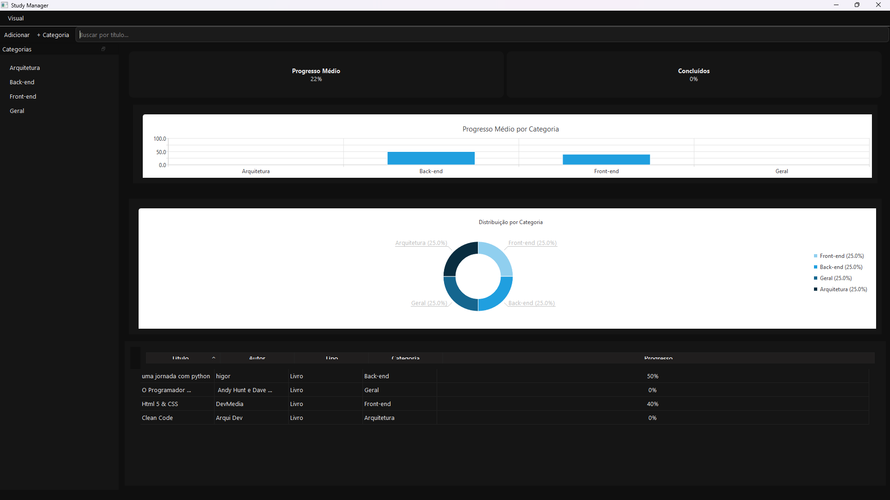
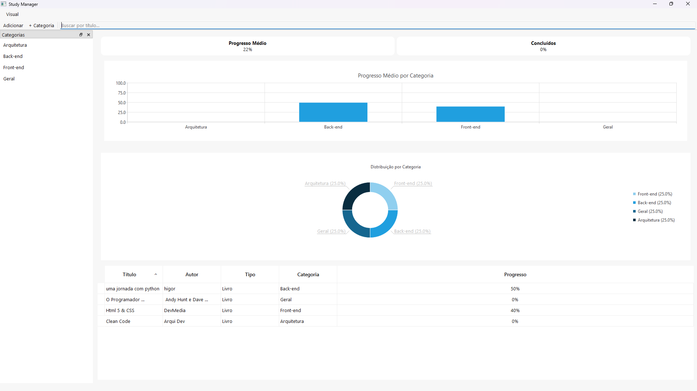
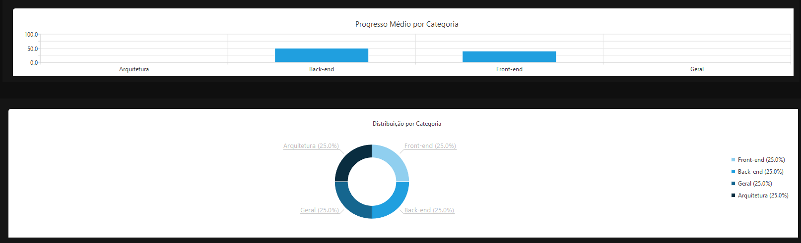

📚 Study Manager

Aplicação desktop desenvolvida em Python com PySide6 (Qt 6), focada no gerenciamento de materiais de estudo, organização por categorias, acompanhamento de progresso e visualização estatística interativa.

O projeto adota arquitetura modular, persistência em SQLite, filtros dinâmicos e testes automatizados, sendo desenvolvido com foco em qualidade de código e escalabilidade.

✨ Funcionalidades

📖 Cadastro de materiais (livros, cursos, artigos, vídeos)  
🗂️ Organização por categorias  
📊 Acompanhamento de progresso (%)  
🍩 Gráfico Donut interativo por categoria  
📊 Gráfico de barras com progresso médio  
🔍 Busca em tempo real por título  
🎯 Modo foco (oculta painéis e dashboards)  
🌙 Dark / Light mode  
💾 Persistência em SQLite  
✅ Testes automatizados com pytest  

📊 Interface (Visão Geral)

<p align="center">
  
</p>

<p align="center">
  <em>Dashboard principal com gráficos e estatísticas globais</em>
</p>






🧠 Arquitetura do Projeto

study_manager/
├── database/ # DAOs e persistência
├── models/ # Models e Proxy Models
├── ui/ # Widgets, dialogs, delegates e estilos
├── services/ # Lógica de domínio
├── tests/ # Testes automatizados
├── study.db # Banco SQLite
└── main.py # Entry point


🧪 Testes Automatizados

Cobertura para:
- DAOs (CategoryDAO, MaterialDAO)
- Proxy de filtros
- Model da tabela
- Serviço de estatísticas

```bash
🚀 Como Executar

git clone https://github.com/HigorGLdS/Study_Manager.git
cd study-manager
python -m venv venv
venv\Scripts\activate
pip install -r requirements.txt
python main.py
📌 Destaques Técnicos

Uso avançado de QSortFilterProxyModel

Sincronização bidirecional entre UI (Donut ↔ Lista)

Persistência desacoplada via DAO

Atualização de gráficos sem perda de estado

Código preparado para expansão futura

📈 Roadmap

📤 Exportação CSV / PDF
📅 Histórico de progresso
🌐 Versão web
☁️ Sincronização em nuvem

👤 Autor

Desenvolvido por Higor Gabriel
Projeto criado para portfólio profissional
